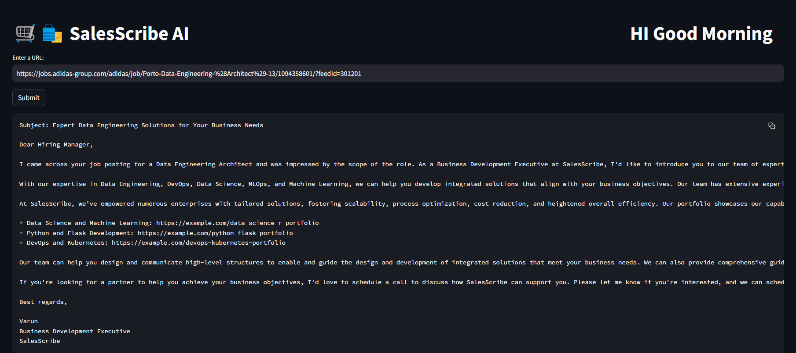
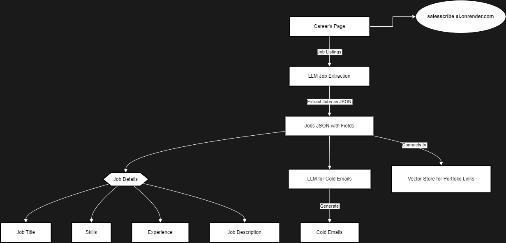

 
## 🛒🛍️ SalesScribe AI
Cold email generator for services company using groq, langchain and streamlit. It allows users to input the URL of a company's careers page. The tool then extracts job listings from that page and generates personalized cold emails. These emails include relevant portfolio links sourced from a vector database, based on the specific job descriptions. 
**Imagine a scenario:** 🔗 [Website-Link](http://43.204.94.189:8501/)

- A company needs a Principal Software Engineer and is spending time and resources in the hiring process, on boarding, training etc
- SalesScribe is Software Development company can provide a dedicated software development engineer to company. So, the business development executive (Varun) from SalesScribe is going to reach out to Nike via a cold email.


 https://github.com/user-attachments/assets/46e04360-2a49-4ff2-ab52-f4c804a97c23/ 





## Architecture Diagram


## Set-up
1. To get started we first need to get an API_KEY from here: https://console.groq.com/keys. Inside `app/.env` update the value of `GROQ_API_KEY` with the API_KEY you created. 


2. To get started, first install the dependencies using:
    ```commandline
     pip install -r requirements.txt
    ```
   
3. Run the streamlit app:
   ```commandline
   streamlit run app/main.py
   ```
